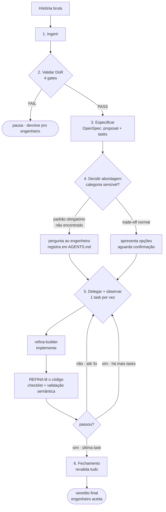

# REFINA v1.0

Orquestrador de entrega de história de usuário — valida, especifica via
OpenSpec, decide abordagem técnica com o engenheiro, delega implementação
e revisa em loop até a entrega estar pronta.

> É mais barato gastar alguns minutos alinhando a especificação antes do
> que descobrir, no final, que o código não corresponde ao que foi pedido.

---

## Visão geral

REFINA nasceu de uma pergunta prática: e se, em vez de mandar a história
direto para um agente de desenvolvimento, alguém — humano ou agente —
garantisse primeiro que ela está clara o suficiente pra ser implementada
sem ambiguidade escondida?

A analogia de origem é o loop de agentes autônomos de codificação
(plan → execute → observe → re-plan). REFINA aplica a mesma disciplina,
mas voltada à **entrega de uma história inteira**, não só à escrita de
código: ele decide o quê fazer e quando, mas nunca escreve código de
produção diretamente — isso é sempre delegado ao subagente
`refina-builder`.

---

## Diagrama do loop



---

## As 6 fases

### 1. Ingerir — *automática*
Lê a história completa. Se vier só um link sem conteúdo, pede o texto —
nunca assume o conteúdo de um sistema que não consegue acessar.

### 2. Validar DoR — *checkpoint*
Roda os 4 gates de Definition of Ready. Reprovação em qualquer gate para
o loop até a história ser ajustada — nunca avança "torcendo pra dar certo".

### 3. Especificar — *automática, com output visível*
Gera `proposal.md`, spec deltas e `tasks.md` em `openspec/changes/`.
Mostra o conteúdo no chat — nunca escreve silenciosamente.

### 4. Decidir abordagem técnica — *checkpoint*
Detecta categorias sensíveis (fila, API, autenticação, criptografia),
busca precedente no repo e pergunta se não encontrar — nunca improvisa
uma solução genérica quando existe padrão corporativo obrigatório. A
resposta fica registrada em `AGENTS.md` para a próxima história.

### 5. Delegar e observar — *loop até entregar*
Uma task por vez ao `refina-builder`. Depois de cada retorno, REFINA lê
o código (checklist de qualidade) e valida se o teste realmente cobre a
regra de negócio — não só se "passou o build". Reprovação gera nova
delegação com feedback específico, até 3 tentativas.

### 6. Fechamento — *checkpoint*
Revalida tudo contra o resultado final e devolve o veredito consolidado.
Só o engenheiro humano fecha a história — REFINA nunca se autodeclara
pronto.

---

## Gates de DoR

Cada gate exige evidência citada da própria história — nunca "parece bom".

| Gate | Valida |
|---|---|
| Valor & Dor | Problema do usuário claro, métrica de sucesso, rastreável a um epic |
| Funcional (INVEST) | Critérios de aceite testáveis em Given/When/Then, casos de borda listados |
| Técnico | Compatibilidade com arquitetura existente, dependências mapeadas |
| Não-funcional | Performance, segurança, observabilidade — reprovação automática se envolve dado sensível e nada foi dito |

---

## Qualidade de código & validação semântica de teste

Esta revisão é feita pelo próprio REFINA lendo o código — não por script
determinístico. Um script pega padrão mecânico; julgar se um teste cobre
a regra de negócio exige entender o que o código faz.

**Checklist de qualidade de código:**
- **Duplicação** — lógica repetida que deveria estar extraída
- **Métodos longos** — responsabilidade única, ou misturando validação + negócio + acesso a dado
- **Aninhamento profundo** — daria pra simplificar com early return?
- **Nomenclatura** — nomes comunicam intenção, ou são genéricos?
- **Acoplamento desnecessário** — reusa abstração existente, ou introduz dependência nova sem necessidade?

**Validação semântica de teste:**
- O teste constrói um cenário que exercita a regra de negócio, não só chama o método?
- Se a lógica estivesse errada, o teste realmente falharia?
- Assert genérico (`assertNotNull`) sem checar valor específico é reprovação automática

---

## Padrões técnicos corporativos

Em vez de manter uma tabela de frameworks obrigatórios (inviável de
manter atualizada), REFINA detecta categoria sensível, busca precedente
no próprio repositório via `Grep`/`Glob`, e só pergunta quando não
encontra nada — a resposta vira conhecimento permanente em `AGENTS.md`.

> **Exemplo:** história menciona fila SQS → REFINA busca uso existente de
> client de mensageria no repo → não encontra → pergunta qual framework
> interno usar → engenheiro responde uma vez → próxima história com fila
> já encontra a resposta registrada, sem perguntar de novo.

---

## Estrutura de arquivos

```
seu-repo/
└── .claude/agents/
    ├── refina.md            # orquestrador
    └── refina-builder.md    # implementador
```

---

## Instalação

1. Copie os 2 arquivos para `.claude/agents/` no repositório.
2. Commit — o Claude Code detecta o subagente automaticamente, sem
   restart na maioria dos casos.
3. Invoque naturalmente: *"REFINA, entrega a história HIST-XXXX"* ou
   peça explicitamente: *"usa o refina para essa história"*.
